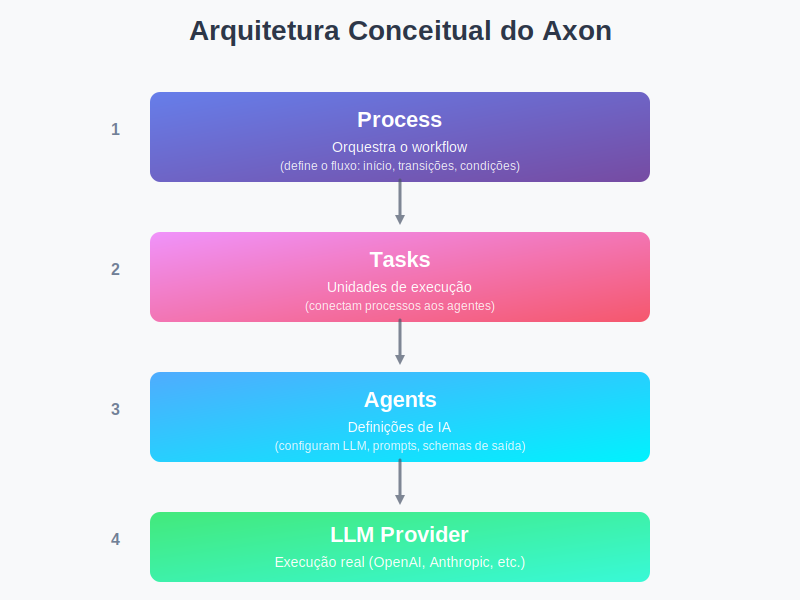

# Axon

**Axon** é um motor de orquestração de agentes de IA orientado a dados, projetado para permitir a criação, edição e execução de workflows de agentes **sem alteração de código**.

## 🎯 O que é o Axon?

Imagine que você precisa criar um fluxo de trabalho onde um agente de IA:
1. Analisa um documento de requisitos de um cliente
2. Extrai as informações principais e avalia a complexidade
3. Se a complexidade for baixa (≤ 3), gera automaticamente uma proposta técnica
4. Se for alta (> 3), encaminha para um especialista revisar os requisitos

Com Axon, você **define esse fluxo inteiro no banco de dados** — incluindo os agentes, as tarefas, as condições e as transições. Nenhuma linha de código precisa ser modificada para criar ou alterar esse comportamento.

## 🧩 Como funciona?

### Arquitetura Conceitual

O Axon organiza a execução de agentes em 4 camadas principais:



### Componentes Principais

#### 1. **Agent** — A Definição da Inteligência

Um Agent é uma configuração que define **como** um agente de IA deve se comportar:

```python
Agent.objects.create(
    name="RequirementsAnalyzer",
    role="Technical Analyst",
    system_prompt="Você é um analista técnico especializado em extrair e avaliar requisitos de projetos de software.",
    llm_config={
        "provider": "openai",
        "model": "gpt-4",
        "temperature": 0.3
    }
)
```

**Importante**: Um Agent é apenas uma definição — ele não executa nada sozinho.

#### 2. **Task** — A Unidade de Execução

Uma Task conecta um Agent a um contexto de execução específico:

```python
Task.objects.create(
    name="analyze_requirements",
    agent=requirements_analyzer,
    input_mapping={
        "document": "input.document"  # Pega do input inicial
    },
    output_mapping={}  # Usa saída padrão
    output_schema={
        "requirements": "array",
        "complexity": "number",
        "summary": "string"
    }
)
```

**Mapeamento de Dados**:
- `input_mapping`: Define como os dados do estado global são passados para o agent
- `output_mapping`: Define como a saída do agent é estruturada no estado

#### 3. **Process** — O Workflow Orquestrado

Um Process define o fluxo de execução completo:

```python
process = Process.objects.create(
    name="ProposalGenerationProcess",
    entry_task=analyze_requirements  # Por onde começar
)
```

#### 4. **ProcessTransition** — As Rotas Condicionais

Transitions definem **quando** e **para onde** o fluxo deve ir:

```python
# Se complexidade <= 3 → gera proposta automaticamente
ProcessTransition.objects.create(
    process=process,
    from_task=analyze_requirements,
    to_task=generate_proposal,
    condition="results.analyze_requirements.complexity <= 3",
    order=1
)

# Se complexidade > 3 → encaminha para especialista
ProcessTransition.objects.create(
    process=process,
    from_task=analyze_requirements,
    to_task=escalate_to_specialist,
    condition="results.analyze_requirements.complexity > 3",
    order=2
)
```

### Fluxo de Execução

Quando você executa um processo:

```python
executor = ProcessExecutor("ProposalGenerationProcess")
result = executor.execute(
    input_payload={
        "document": "Cliente precisa de um sistema de gerenciamento de estoque..."
    }
)
```

Internamente, o Axon:

1. **Carrega o Process** do banco de dados
2. **Inicia pela entry_task** (analyze_requirements)
3. **Resolve o input_mapping** para construir o input do agent
4. **Executa o Agent** através do LLM configurado
5. **Armazena o resultado** no estado global
6. **Avalia as transitions** para determinar a próxima task
7. **Repete o processo** até não haver mais transições válidas
8. **Persiste toda a execução** para auditoria e análise

### Estado Global

Durante a execução, o Axon mantém um estado compartilhado:

```json
{
  "input": {
    "document": "Cliente precisa de um sistema de gerenciamento de estoque..."
  },
  "results": {
    "analyze_requirements": {
      "requirements": [
        "Controle de entrada e saída",
        "Relatórios em tempo real",
        "Integração com ERP"
      ],
      "complexity": 5,
      "summary": "Sistema de média complexidade com integrações"
    },
    "escalate_to_specialist": {
      "status": "escalated",
      "specialist_id": "SP-001"
    }
  },
  "meta": {}
}
```

Esse estado é:
- **Serializável**: Pode ser salvo e recuperado
- **Rastreável**: Histórico completo de execução
- **Compartilhado**: Todas as tasks acessam o mesmo estado

## 🔧 Integração com LangChain/LangGraph

O Axon **não reimplementa** funcionalidades de LLM — ele **orquestra** ferramentas existentes:

| Camada | Responsabilidade | Tecnologia |
|--------|------------------|------------|
| Definição de Agentes | Models Django | Django ORM |
| Criação de Runtimes | AgentFactory | Python |
| Execução de Agentes | AgentRuntime | LangChain |
| Orquestração | ProcessExecutor | Python + Transitions |
| Construção de Grafos | GraphBuilder | LangGraph (futuro) |

## 📊 Rastreabilidade e Auditoria

Toda execução é persistida:

```python
ProcessExecution  # Registro completo da execução
  ├── input_payload
  ├── state (estado final)
  ├── status (running/completed/failed)
  └── TaskExecution[] (histórico de cada task)
        ├── input_payload
        ├── output_payload
        ├── started_at
        └── finished_at
```

Isso permite:
- **Replay** de execuções
- **Debugging** de fluxos complexos
- **Análise** de performance
- **Auditoria** completa

## 🚀 API REST

Execute processos via HTTP:

```bash
POST /api/v1/processes/1/execute/
{
  "document": "Cliente precisa de um sistema de gerenciamento de estoque com integração ERP..."
}
```

Consulte execuções:

```bash
GET /api/v1/processes/1/executions/
GET /api/v1/executions/123/
GET /api/v1/executions/123/tasks/
```

## 💡 Princípios de Design

### 1. **Data-Driven**
Comportamento é configuração, não código.

### 2. **Separation of Concerns**
- Models: Definição e persistência
- Services: Lógica de execução
- API: Interface externa

### 3. **Versionamento**
Agents e Processes são versionados — mudanças não quebram execuções anteriores.

### 4. **Estado Explícito**
Todo estado é serializável e rastreável.

### 5. **Composição**
Tasks e Agents são reutilizáveis em múltiplos processos.

## 🗂️ Estrutura do Projeto

```
axon/
├── core/
│   ├── models/              # Definições de dados
│   │   ├── agent.py
│   │   ├── task.py
│   │   ├── process.py
│   │   ├── process_transition.py
│   │   ├── process_execution.py
│   │   └── task_execution.py
│   │
│   ├── services/            # Lógica de execução
│   │   ├── agent_factory.py
│   │   ├── agent_runtime.py
│   │   ├── process_executor.py
│   │   ├── condition_evaluator.py
│   │   ├── mapping_resolver.py
│   │   └── llm_provider.py
│   │
│   └── api/                 # Interface HTTP
│       ├── views.py
│       ├── serializers.py
│       └── urls.py
│
├── settings.py
├── urls.py
└── manage.py
```

## 🎯 Casos de Uso

### Workflows de Conteúdo
- Geração → Revisão → Publicação
- Criação → Validação de qualidade → Distribuição

### Processamento de Dados
- Extração → Classificação → Enriquecimento
- Análise → Decisão → Ação

### Automação de Negócios
- Triagem de tickets → Roteamento → Resolução
- Análise de leads → Qualificação → Encaminhamento

## 🛠️ Tecnologias

- **Django 6.0**: Framework web e ORM
- **LangChain**: Integração com LLMs
- **LangGraph**: Orquestração de grafos (futuro)
- **MySQL**: Persistência
- **Django REST Framework**: API

## 📦 Instalação

```bash
# Clone o repositório
git clone [url-do-repo]

# Configure o ambiente
cp .env.example .env
# Edite .env com suas credenciais

# Instale dependências
pip install -r requirements.txt

# Execute migrações
python manage.py migrate

# Inicie o servidor
python manage.py runserver
```

## 🧪 Testes

```bash
python manage.py test core.tests.test_process_workflow
```

## 🔮 Roadmap

- [ ] Interface web para configuração visual
- [ ] Suporte a execução assíncrona (Celery)
- [ ] Observabilidade avançada (traces, métricas)
- [ ] Suporte a múltiplos LLM providers
- [ ] Sistema de plugins para ferramentas customizadas
- [ ] Editor visual de workflows
- [ ] Templates de processos comuns

## 📝 Filosofia

> **"Código define capacidades. Banco de dados define comportamento."**

O Axon existe para que você nunca precise alterar código para mudar como seus agentes funcionam. Toda a inteligência do negócio vive nos dados, não no código-fonte.

## 📄 Licença

Este projeto está licenciado sob a **MIT License** - veja o arquivo [license.txt](./license.txt) para mais detalhes.

A licença MIT permite que você:
- ✅ Use o software comercialmente
- ✅ Modifique o código
- ✅ Distribua cópias
- ✅ Use de forma privada
- ✅ Integre em projetos proprietários

**Única exigência**: Manter o aviso de copyright e a licença em todas as cópias.

## 🤝 Contribuindo

Contribuições são bem-vindas! Por favor, abra uma issue antes de criar um PR para discussão.

---

**Axon** — Orquestração de agentes de IA orientada a dados.
